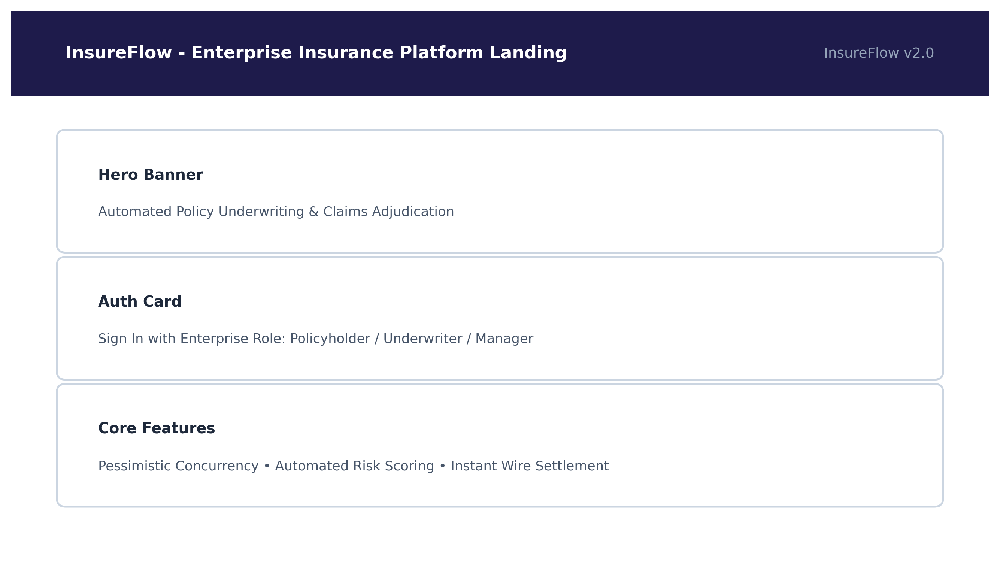

# InsureFlow - Next-Generation Insurance Claims & Risk Management Platform



## Overview
**InsureFlow** is an enterprise-grade full-stack insurance policy lifecycle, underwriting risk analysis, claims adjudication, and automated disbursement orchestration platform. It is built with high reliability, role-based access control (RBAC), and modern aesthetic user experience.

---

## Tech Stack

### Backend
- **Java 17+ / Spring Boot 3.x**
- **Spring Security 6** with JWT (JSON Web Tokens) Stateless Authentication
- **Spring Data JPA / Hibernate**
- **H2 / PostgreSQL / MySQL** Database compatibility
- **Swagger / OpenAPI 3** Documentation

### Frontend
- **React 18** with **Vite**
- **Lucide React** for modern iconography
- **Vanilla CSS** custom design system with glassmorphism and modern responsive UI
- **Axios** for REST API integration and token interceptors

---

## Key Modules & Features

1. **Enterprise Security & Authentication (`/api/auth`)**:
   - Multi-role registration & login (`POLICYHOLDER`, `UNDERWRITER`, `CLAIMS_ADJUSTER`, `ADMIN`).
   - Secure BCrypt password hashing & JWT token expiration control.

2. **Policy Lifecycle & Underwriting (`/api/policies`, `/api/risk`)**:
   - Actuarial risk assessment engine calculating composite risk tiers (`LOW`, `MEDIUM`, `HIGH`, `CRITICAL`).
   - Automated premium rating and real-time policy issuance.

3. **Claims Intake & Adjudication (`/api/claims`)**:
   - Digital claim submission with incident categorization and automated verification.
   - Adjuster workflow: Approve, Deny, Request More Info, and Flag for Fraud.

4. **Automated Disbursement Orchestration (`/api/disbursements`)**:
   - Settlement tracking, idempotency tokens, bank gateway payload simulation, and PDF/Digital receipt generation.

5. **Operational Analytics (`/api/analytics`)**:
   - Live metrics, claim throughput, loss ratios, risk distributions, and underwriting performance charts.

6. **Public Status Tracker (`/api/public/claims/track`)**:
   - Real-time guest tracking for claim status by Claim ID and Policy Number.

---

## Directory Structure

```
├── backend/                  # Spring Boot backend application
│   ├── src/main/java/com/insureflow/
│   │   ├── config/           # Security, CORS, OpenAPI configs
│   │   ├── controller/       # REST API endpoints
│   │   ├── dto/              # Request & Response DTOs
│   │   ├── exception/        # Global error handlers
│   │   ├── model/            # JPA entities & Enums
│   │   ├── repository/       # Data access layer
│   │   ├── security/         # JWT filters, UserDetailsService
│   │   └── service/          # Business logic services
│   └── pom.xml
├── frontend/                 # Vite + React frontend application
│   ├── src/
│   │   ├── components/       # Reusable UI components
│   │   ├── context/          # Auth context & state
│   │   ├── pages/            # Feature pages & dashboards
│   │   └── services/         # Axios API clients
│   └── package.json
├── assets/                   # Architecture diagrams & screenshots
├── scripts/                  # Workflow automation & asset generation
└── InsureFlow_Mini_Project_Report.docx
```

---

## Getting Started

### Backend Setup
```bash
cd backend
./mvnw spring-boot:run
# Backend will start on http://localhost:8080
# Swagger UI available at: http://localhost:8080/swagger-ui/index.html
```

### Frontend Setup
```bash
cd frontend
npm install
npm run dev
# Frontend will start on http://localhost:5173
```

---

## Author
- **ABISHEK B K** ([GitHub Profile](https://github.com/ABISHEK-B-K2006))
